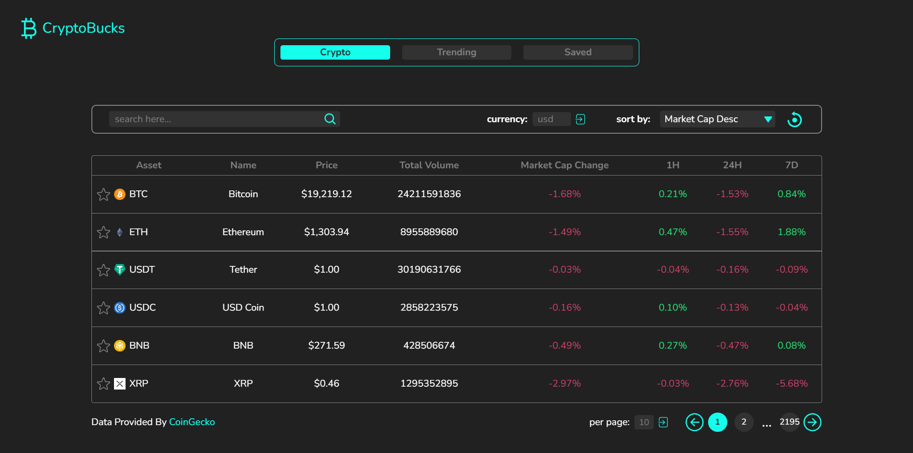
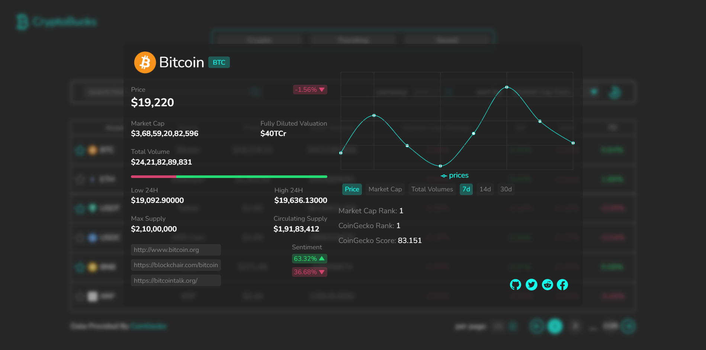
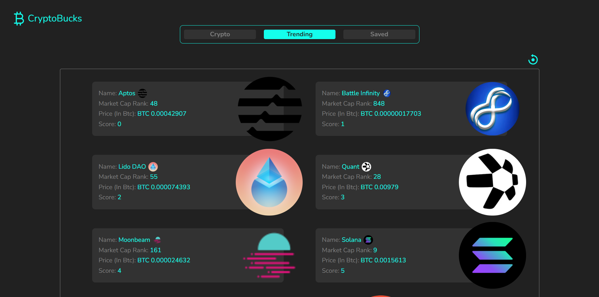
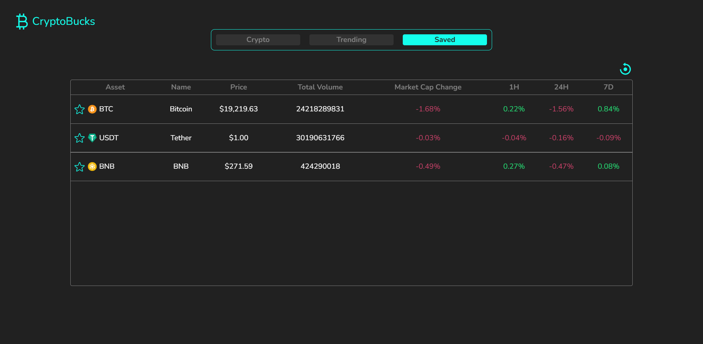
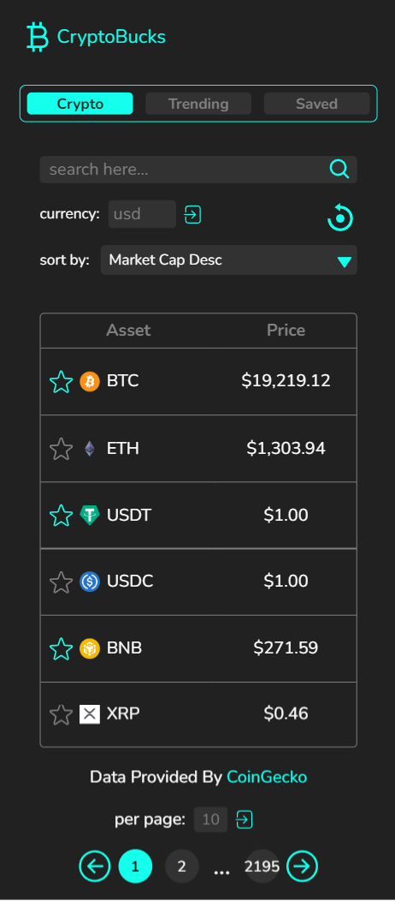
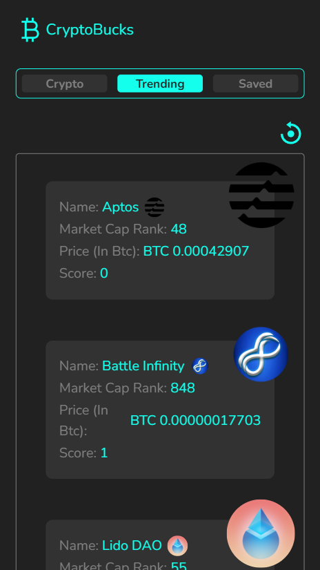
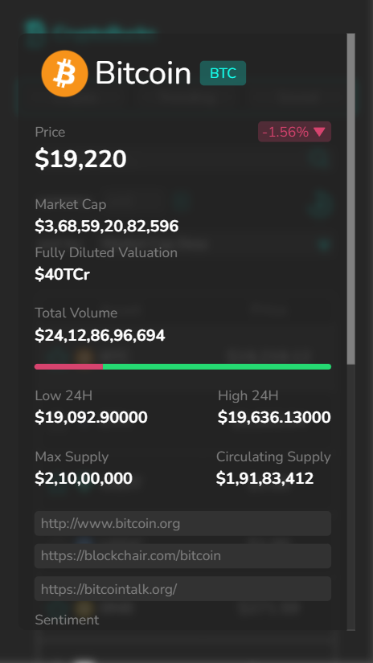

# 🚀 Crypto Screener React Application

## 📝 Project Overview

This Crypto Screener is a sophisticated React application that provides a real-world platform for exploring cryptocurrency market data. Designed as a full-featured web application, it demonstrates the practical implementation of modern React development techniques and web technologies.









## 🌟 Key Features

- **Real-time Cryptocurrency Data**: Fetch and display up-to-date cryptocurrency information
- **Search Functionality**: Easily find specific cryptocurrencies
- **Sorting and Filtering**: Organize cryptocurrencies by various metrics
- **Currency Conversion**: View prices in different local currencies
- **Bookmarking**: Save and track your favorite cryptocurrencies
- **Trending Coins**: Discover currently popular cryptocurrencies
- **Interactive Charts**: Visualize cryptocurrency performance
- **Mobile Responsive**: Fully responsive design for all device types

## 🛠 Technologies and Libraries Used

- **React JS** (Create React App)
- **Tailwind CSS** for styling
- **React Context API** for state management
- **React Router** for navigation
- **Recharts** for interactive charts
- **CoinGecko API** for cryptocurrency data

## 📂 Project Structure

```
src/
├── Pages/
│   ├── Crypto.jsx
│   ├── Home.jsx
│   │   ├── Logo.jsx
│   │   ├── Navigation.jsx
│   │   └── Outlet.jsx
│   ├── Saved.jsx
│   │   ├── SaveButton.jsx
│   │   └── Outlet.jsx
│   └── Trending.jsx
│       ├── TrendingCoin.jsx
│       └── Outlet.jsx
└── Context/
    ├── CryptoContext.js
    ├── StorageContext.js
    └── TrendingContext.js
```

## 🔑 Key React Concepts Demonstrated

### Context API Implementation

#### CryptoContext.js
A comprehensive example of using React Context for global state management:

```javascript
import { createContext, useEffect, useState } from "react";

export const CryptoContext = createContext({});

export function CryptoProvider({ children }) {
  // State management for crypto data
  const [CryptoData, setCryptoData] = useState();
  const [searchData, setSearchData] = useState();
  const [coinSearch, setCoinSearch] = useState("");
  const [currency, setCurrency] = useState("usd");
  const [sortBy, setSortBy] = useState("market_cap_desc");
  const [page, setPage] = useState(1);

  // Async function to fetch cryptocurrency data
  async function getData() {
    try {
      const data = await fetch(
        `https://api.coingecko.com/api/v3/coins/markets?vs_currency=${currency}&ids=${coinSearch}&order=${sortBy}&per_page=${perPage}&page=${page}&sparkline=false&price_change_percentage=1h%2C24h%2C7d&locale=en&x_cg_demo_api_key=CG-xPTDuU1xWf9V99UybnaCu79t`
      ).then((res) => res.json());

      setCryptoData(data);
    } catch (error) {
      console.log(error);
    }
  }

  // useEffect to trigger data fetching
  useEffect(() => {
    getData();
  }, [coinSearch, currency, sortBy, page, perPage]);

  return (
    <CryptoContext.Provider
      value={{
        CryptoData,
        searchData,
        currency,
        setCurrency,
        // ... other context values
      }}
    >
      {children}
    </CryptoContext.Provider>
  );
}
```

#### StorageContext.js
Demonstrating local storage integration:

```javascript
import { createContext, useContext, useLayoutEffect, useState, useEffect } from "react";
import { CryptoContext } from "./CryptoContext";

export const StorageContext = createContext({});

export function StorageProvider({ children }) {
  const [allCoins, setAllCoins] = useState([]);
  const [savedData, setSavedData] = useState();

  const { currency, sortBy } = useContext(CryptoContext);

  // Function to save a coin to local storage
  const saveCoin = (coinId) => {
    let oldCoins = JSON.parse(localStorage.getItem("coins"));
    
    if (oldCoins.includes(coinId)) {
      return null;
    } else {
      let newCoin = [...oldCoins, coinId];
      setAllCoins(newCoin);
      localStorage.setItem("coins", JSON.stringify(newCoin));
    }
  };

  // useLayoutEffect to initialize local storage
  useLayoutEffect(() => {
    let isThere = JSON.parse(localStorage.getItem("coins")) || false;

    if (!isThere) {
      localStorage.setItem("coins", JSON.stringify([]));
    } else {
      let totalCoins = JSON.parse(localStorage.getItem("coins"));
      setAllCoins(totalCoins);
    }
  }, []);

  return (
    <StorageContext.Provider
      value={{
        allCoins,
        saveCoin,
        savedData,
      }}
    >
      {children}
    </StorageContext.Provider>
  );
}
```

## 🧭 Pagination Component Deep Dive

### Pagination Logic Explained

The pagination component in this project is a sophisticated implementation that provides a flexible and user-friendly way to navigate through cryptocurrency data. Let's break down its key features and logic:

#### Core Pagination Mechanics

The pagination component handles several critical aspects of data navigation:

1. **Dynamic Page Rendering**
   - Calculates total number of pages based on data and items per page
   - Dynamically shows page numbers
   - Provides intuitive navigation controls

2. **Flexible Page Navigation**
   The component supports multiple types of page navigation:
   - Single page steps (previous/next)
   - Multi-step jumps (skipping multiple pages)
   - Direct page selection

#### Key Functions Breakdown

```javascript
// Calculate total number of pages
const TotalNumber = Math.ceil(totalPages / perPage);

// Move to next page
const next = () => {
  if (page === TotalNumber) {
    return null; // Prevent going beyond last page
  } else {
    setPage(page + 1);
  }
};

// Move to previous page
const prev = () => {
  if (page === 1) {
    return null; // Prevent going before first page
  } else {
    setPage(page - 1);
  }
};
```

#### Advanced Navigation Methods

##### Multi-Step Navigation
```javascript
// Jump forward multiple pages
const multiStepNext = () => {
  if (page + 3 >= TotalNumber) {
    setPage(TotalNumber - 1); // Prevent overshooting
  } else {
    setPage(page + 3); // Move 3 pages forward
  }
};

// Jump backward multiple pages
const multiStepPrev = () => {
  if (page - 3 <= 1) {
    setPage(TotalNumber + 1); // Wrap around to last page
  } else {
    setPage(page - 2); // Move 2 pages backward
  }
};
```

#### Intelligent Page Number Display

The component smartly renders page numbers:
- Shows current page as a disabled button
- Displays previous and next page numbers when applicable
- Uses ellipsis (...) to indicate more pages exist
- Provides a direct link to the last page

#### Per Page Control

An additional `PerPage` component allows users to:
- Dynamically change number of items displayed per page
- Set a range between 1-250 items
- Instantly update the data view

```javascript
const PerPage = () => {
  const { setPerPage } = useContext(CryptoContext);
  const inputRef = useRef(null);

  const handleSubmit = (e) => {
    e.preventDefault();
    let val = inputRef.current.value;
    if (val !== 0) {
      setPerPage(val);
    }
  };

  return (
    <form onSubmit={handleSubmit}>
      <label>per page: </label>
      <input
        type="number"
        min={1}
        max={250}
        ref={inputRef}
        placeholder="10"
      />
      <button type="submit">Submit</button>
    </form>
  );
};
```

### Design Considerations

- **Performance**: Minimizes unnecessary re-renders
- **Flexibility**: Adapts to varying dataset sizes
- **User Experience**: Provides intuitive navigation controls
- **Context Integration**: Seamlessly works with React Context API

### Potential Improvements

While the current implementation is robust, potential enhancements could include:
- Keyboard navigation support
- Accessibility improvements
- More granular page jump controls


### Routing Configuration

```javascript
const router = createBrowserRouter([
  {
    path: "/",
    element: <Home />,
    children: [
      {
        path: "/",
        element: <Crypto />,
        children: [
          {
            path: ":coinID",
            element: <CryptoDetails />,
          },
        ],
      },
      {
        path: "/trending",
        element: <Trending />,
        children: [
          {
            path: ":coinId",
            element: <CryptoDetails />
          }
        ]
      },
      {
        path: "/saved",
        element: <Saved />,
      },
    ],
  },
]);
```

## 🌐 Live Demo

Check out the live application: [Crypto Screener Demo](https://ephemeral-clafoutis-a06fc8.netlify.app/)

## 🛡️ API Integration

Uses CoinGecko's free API with a demo API key for:
- Cryptocurrency market data
- Trending coins
- Coin details
- Search functionality

## 📦 Getting Started

### Prerequisites

- Node.js (v14 or later)
- npm or yarn

### Installation

1. Clone the repository
   ```bash
   git clone https://github.com/Tharun-Balaji/React.js.git
   ```

2. Navigate to the project directory
   ```bash
   cd React-Projects/crypto-app
   ```

3. Install dependencies
   ```bash
   npm install
   ```

4. Start the development server
   ```bash
   npm start
   ```

## 🤝 Contributing

Contributions, issues, and feature requests are welcome! Feel free to check the [issues page](https://github.com/Tharun-Balaji/React.js/issues).

## 📄 License

This project is open source. Please check the original repository for specific licensing information.

## 👨‍💻 Author

Tharun Balaji

## 🙏 Acknowledgements

- [CoinGecko API](https://www.coingecko.com/en/api/documentation)
- [React Documentation](https://reactjs.org/)
- [Tailwind CSS](https://tailwindcss.com/)